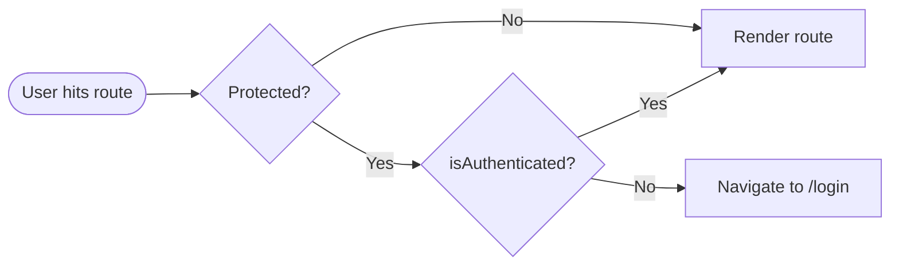
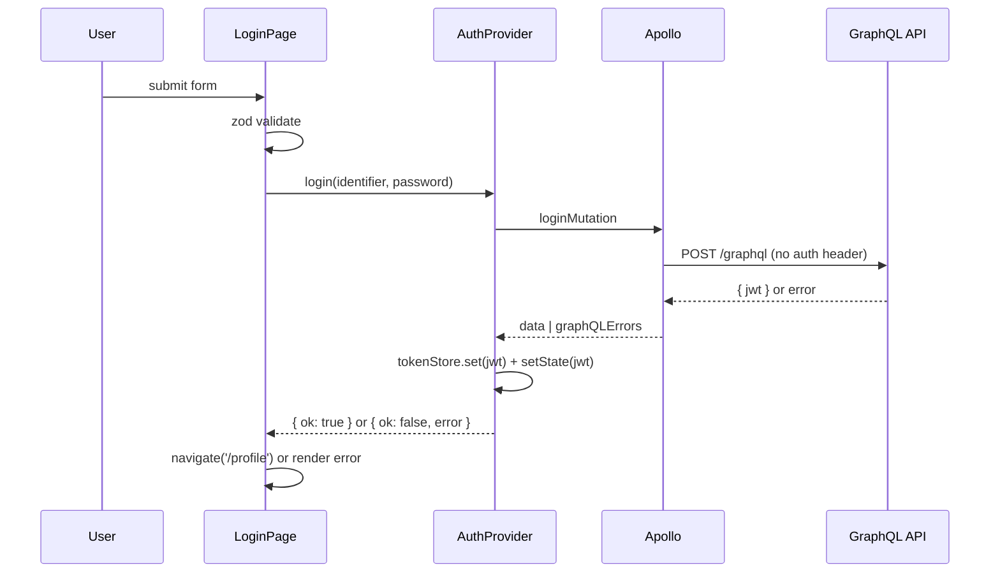

# feat: React + Apollo auth boilerplate (login + profile)

## Overview

Bootstrap a React + TypeScript SPA that authenticates against the FreshCells trial GraphQL API, displays the logged-in user's profile, and supports en/de localization. The deliverable is both a working two-screen app (Login → Profile) and a reusable boilerplate: a folder structure, an Apollo client wired with auth/retry/error links, an in-memory `AuthProvider`, i18n scaffolding, shared Header/Footer, and a Tailwind-based silver/black visual style.

## Problem Frame

We need a small but production-shaped React frontend against the FreshCells CMS GraphQL endpoint. The brief is light on backend surface (only `login` mutation and `user` query are confirmed; no logout endpoint exists in the schema), so auth lifecycle is owned by the client. The user has explicitly chosen security over UX continuity (in-memory token, no localStorage), which means a page reload is an accepted "you are logged out" event. The boilerplate also needs to scale: another developer should be able to add a new authenticated screen without re-deriving how auth headers, retries, or i18n work.

## Requirements Trace

- **R1.** GraphQL client uses Apollo and points at `https://cms.trial-task.k8s.ext.fcse.io/graphql`, with the URL imported from a single, central config module.
- **R2.** Auth token lives only in application memory (React state + a small in-memory holder for Apollo middleware). It is **not** persisted to `localStorage`/`sessionStorage`/cookies. Page reload returns the user to `/login`.
- **R3.** An `AuthProvider` exposes `login(identifier, password)`, `logout()`, current token, and `isAuthenticated`. Children consume via a `useAuth` hook.
- **R4.** Authenticated requests are signed with `Authorization: Bearer <token>` automatically by an Apollo link — calling code must not set the header per request. Unauthenticated operations (login mutation) must still work when no token is present.
- **R5.** Apollo retries failed requests **only** on HTTP `502`, `503`, `429`. Max 3 retries. Delay increases between attempts (exponential backoff with jitter). Other status codes (e.g., 400, 401, 500) and GraphQL-level errors do not trigger retry.
- **R6.** **Login screen:** identifier and password inputs with correct `type` attributes, native tab navigation, Zod-validated form, inline field errors near each field, server-side error rendered in the UI, redirect to `/profile` on success.
- **R7.** **Profile screen:** non-editable display of `firstName` and `lastName` fetched via the `user(id: 2)` query, plus a logout button. Logout clears token and routes to `/login`.
- **R8.** **Header (shared):** "FreshCells" logo/text on the left; language switcher on the right; logout button visible on the right only when authenticated. Logout from Header has the same effect as Profile-page logout.
- **R9.** **Footer (shared):** identical content for authenticated and unauthenticated users; standard placeholder content acceptable.
- **R10.** i18n via `i18next` + `react-i18next`, languages `en` and `de`, all user-facing strings consumed via `useTranslation`.
- **R11.** Tailwind CSS for styling. Visual tone: clean and "expensive" — silver/light-neutral surfaces with black primary buttons.
- **R12.** Folder structure is a deliberate, documented boilerplate suitable for additional features.

## Scope Boundaries

- No persistent sessions, no refresh-token flow, no "remember me" — explicitly out of scope by R2.
- No backend logout call (the schema lacks a logout mutation, confirmed by introspection).
- No registration, password reset, or other auth flows.
- No SSR / Next.js — SPA only. In-memory auth + reload-clears-session would conflict with SSR hydration assumptions.
- No global state library (Redux/Zustand) — Apollo cache + AuthProvider context are sufficient for this surface area.
- No GraphQL codegen pipeline in v1 (typed SDK from schema). May be added later; not required for two operations.
- No analytics, tracking, error reporting service integration.
- No design system / component library (e.g., shadcn, Radix). Plain Tailwind classes against semantic HTML.
- No e2e/Playwright suite. Unit + component tests via Vitest + RTL only.
- No CI configuration. Lint + test scripts in `package.json` only.

## Context & Research

### Relevant Code and Patterns

- Empty repository — no existing patterns to follow. This plan establishes the conventions other features will inherit.

### Institutional Learnings

- None on disk (`docs/solutions/` does not exist).

### External References

- Apollo Client: `@apollo/client` ships `setContext` (auth) and `RetryLink` (configurable backoff + `retryIf` predicate keyed off `error.statusCode` from `ServerError`). These are the canonical building blocks for R4 and R5.
- `react-i18next`: `useTranslation` + namespaced JSON resources is the standard pattern for R10.
- Zod + React Hook Form is the conventional pairing for R6 (RHF wires field-level errors trivially via `@hookform/resolvers/zod`); using Zod alone with manual state is also fine but more boilerplate.

## Key Technical Decisions

- **Build tool: Vite + `@vitejs/plugin-react` (TypeScript template).** Fast HMR, first-class TS, Tailwind plays cleanly. Aligns with R12's "boilerplate" intent.
- **Routing: React Router v6 (`react-router-dom`).** Stable, minimal, and the Outlet/`<Navigate>` primitives match the protected-route pattern cleanly.
- **Form: React Hook Form + `@hookform/resolvers/zod` + Zod.** Field-level errors near inputs (R6) is natural with RHF's `formState.errors`. Zod owns the schema; RHF owns the form lifecycle.
- **Token storage: dual layer — React state inside `AuthProvider` (drives re-renders) + a tiny module-scoped `tokenStore` mutable holder (read by Apollo middleware).** Apollo's link chain is constructed once at module load; it cannot read React context. The `tokenStore` is the bridge: `AuthProvider` writes the token to both places on login/logout. On page reload the module is re-evaluated and the holder is empty — consistent with R2.
- **Apollo link chain order (outer → inner):** `errorLink` → `retryLink` → `authLink` → `httpLink`. `authLink` must be inside `retryLink` so retried attempts re-read the current token (e.g., if token was cleared mid-flight). `errorLink` outermost so it observes the final outcome.
- **Retry predicate (R5):** `RetryLink.attempts.retryIf` checks `error?.statusCode` (or `error?.response?.status`) against `[502, 503, 429]`. Anything else — including network failures with no status, GraphQL-level errors, and 4xx auth failures — short-circuits to no retry. `attempts.max = 4` (initial attempt + 3 retries). `delay = { initial: 300, max: 5000, jitter: true }` provides increasing-with-jitter backoff per Apollo defaults.
- **Auth header skip rule:** `authLink` adds `Authorization: Bearer <token>` only when `tokenStore.get()` returns a non-empty string. The login mutation runs without a header naturally because the user is unauthenticated when it fires.
- **Error mapping for login (R6):** Apollo surfaces server errors as `graphQLErrors[0].message`. Map known patterns ("Invalid identifier or password", etc.) to a translation key; fall back to a generic translated error for unknown shapes. Show server-side error as a form-level banner above the fields; field-level errors stay inline.
- **Login validation strictness:** `identifier` is required (non-empty string only — the schema name is `identifier`, not `email`, and may accept usernames; over-constraining to email format risks rejecting valid input). `password` is required, non-empty. Frontend is not the source of truth for password rules; backend will reject invalid combinations.
- **i18n key namespacing:** `common`, `auth`, `profile`. Default language `en`, fallback `en`. Persist user's language choice to `localStorage` via `i18next-browser-languagedetector` — language preference is not a security secret, unlike the JWT.
- **Routing model:**
  - `/login` — public; if already authenticated, redirect to `/profile`.
  - `/profile` — protected via `<ProtectedRoute>`; redirects to `/login` if `!isAuthenticated`.
  - `/` — redirect to `/profile` (which then bounces to `/login` if needed — single source of truth).
  - Anything else — redirect to `/`.
- **Styling: Tailwind v3 with extended theme.** Custom palette: `bg-stone-100`/`bg-zinc-50` for silver-neutral surfaces, `bg-black` / `bg-zinc-950` for primary buttons with white text, `border-zinc-200` for soft separators. System font stack with optional Inter. Generous whitespace, modest type scale. Tailwind v4's CSS-first config is acceptable but adds risk for a boilerplate; v3 is the safer default.
- **Test stack: Vitest + React Testing Library + `@apollo/client/testing` (`MockedProvider`).** Vitest is the native fit for Vite. `MockedProvider` covers GraphQL operations without a network mock layer. No MSW needed for this surface area.
- **TypeScript strictness:** `strict: true` in `tsconfig.json`, `noUncheckedIndexedAccess: true`. Boilerplates that ship lax TS settings tend to stay lax forever.

## Open Questions

### Resolved During Planning

- **Should we use localStorage or in-memory for the token?** In-memory only, per user direction (security > reload UX).
- **Where does Apollo read the token from, given middleware can't subscribe to React state?** A module-scoped `tokenStore` holder, kept in sync by `AuthProvider`. Resolved above.
- **Retry attempt count semantics?** `attempts.max = 4` → initial + 3 retries, matching "max 3 retries" from R5.
- **Should we validate `identifier` as email?** No — schema field name is `identifier`; non-empty string only.
- **Form library?** React Hook Form + Zod resolver. Lighter wiring for inline field errors than rolling our own.
- **Do we need a logout backend call?** No — schema introspection confirmed no `logout` mutation exists; logout is purely client-side state clearing.

### Deferred to Implementation

- **Exact silver/black palette swatches and spacing scale** — best decided while looking at the screen, not in a plan.
- **Exact Apollo `RetryLink` typing for `retryIf`'s `error` argument** — the `ServerError` vs `Error` discrimination is best done while TypeScript surfaces it.
- **Whether to enable `i18next-browser-languagedetector` `cookie` caching in addition to `localStorage`** — minor; default to localStorage only.
- **Final copy for the footer** — placeholder strings are acceptable; final copy can be tweaked once visual layout exists.
- **Whether Header logo is text "FreshCells" or an inline SVG mark** — text is acceptable for v1; swap for SVG later if a brand asset becomes available.
- **GraphQL codegen / typed operations** — adding `graphql-codegen` later will narrow types from `any` to schema-derived types without changing the link chain or auth model.

## High-Level Technical Design

> *This illustrates the intended approach and is directional guidance for review, not implementation specification. The implementing agent should treat it as context, not code to reproduce.*

**Apollo link chain & token bridge:**

```
                     ┌──────────────────┐
React tree           │  AuthProvider     │  React state: token
                     │  (login/logout)   │
                     └─────────┬─────────┘
                               │ writes on login/logout
                               ▼
                     ┌──────────────────┐
Module scope         │   tokenStore      │  plain JS holder
                     │   .get() / .set() │  (cleared on reload)
                     └─────────┬─────────┘
                               │ reads on each request
                               ▼
   operation ─▶  errorLink ─▶ retryLink ─▶ authLink ─▶ httpLink ─▶ network
                   │             │            │
                   │             │            └─ adds Bearer header
                   │             │               iff tokenStore.get()
                   │             └─ retries on 502/503/429 only,
                   │                max 3 retries, exp backoff
                   └─ surfaces final error to UI
```

**Route guard flow:**



**Login flow:**



## Implementation Units

- [ ] **Unit 1: Project scaffolding, tooling, and folder structure**

**Goal:** Stand up a Vite + React + TypeScript project with Tailwind, lint/format, env handling, and the documented folder skeleton — no app behavior yet.

**Requirements:** R1, R11, R12

**Dependencies:** None

**Files:**
- Create: `package.json`, `tsconfig.json`, `tsconfig.node.json`, `vite.config.ts`, `index.html`, `.env.example`, `.env.local`, `.gitignore`, `.editorconfig`, `.prettierrc`, `eslint.config.js`
- Create: `tailwind.config.ts`, `postcss.config.js`, `src/index.css` (with Tailwind directives + base font-family)
- Create: `src/main.tsx`, `src/App.tsx` (placeholder), `src/vite-env.d.ts`
- Create: `src/config/env.ts` (exports `GRAPHQL_URL` resolved from `import.meta.env.VITE_GRAPHQL_URL`, with a typed fallback to the documented production endpoint and a runtime guard for missing values)
- Create empty placeholder `index.ts` files (or README stubs) for: `src/apollo/`, `src/auth/`, `src/components/`, `src/pages/`, `src/i18n/`, `src/i18n/locales/`
- Create: `README.md` documenting folder layout, env vars, and `npm run` scripts
- Test: `src/config/env.test.ts`

**Approach:**
- Use the official Vite `react-ts` template as the starting structure; replace generated boilerplate aggressively to match the boilerplate intent.
- Configure Tailwind with `theme.extend.colors` placeholders for the silver/black palette and a system-font `fontFamily.sans`.
- Set TypeScript `strict: true`, `noUncheckedIndexedAccess: true`, path alias `@/*` → `src/*` (also mirrored in `vite.config.ts`).
- `.env.example` documents `VITE_GRAPHQL_URL`. `src/config/env.ts` is the **only** module that reads `import.meta.env`; everything else imports from it (R1).
- Lint/format minimal: ESLint with `@typescript-eslint`, `eslint-plugin-react`, `eslint-plugin-react-hooks`, `eslint-plugin-jsx-a11y`. Prettier via `eslint-config-prettier`.

**Test scenarios:**
- `env.ts` returns the configured URL when `VITE_GRAPHQL_URL` is set.
- `env.ts` falls back to the documented default when the env var is undefined (or throws — implementer's choice; document in test).

**Verification:**
- `npm install && npm run dev` starts the dev server and renders the App placeholder.
- `npm run build` succeeds with no TS errors.
- `npm run lint` passes.

---

- [ ] **Unit 2: Apollo client + link chain + token store**

**Goal:** Provide a single configured Apollo client with the link chain (error → retry → auth → http), a module-scoped token holder, and gql operation definitions for login and user.

**Requirements:** R1, R4, R5

**Dependencies:** Unit 1

**Files:**
- Create: `src/apollo/tokenStore.ts` — module-scoped mutable holder with `get()`, `set(token | null)`, and (optional) `subscribe(listener)` for diagnostics. No persistence.
- Create: `src/apollo/links/authLink.ts` — uses `setContext` to attach `Authorization: Bearer <token>` when `tokenStore.get()` is truthy; passes through otherwise.
- Create: `src/apollo/links/retryLink.ts` — `RetryLink` with `attempts.max = 4`, `attempts.retryIf` matching status codes `502 | 503 | 429`, `delay = { initial: 300, max: 5000, jitter: true }`.
- Create: `src/apollo/links/errorLink.ts` — `onError` link that logs network/GraphQL errors in dev and is a no-op pass-through in prod (does not swallow errors; UI must still see them).
- Create: `src/apollo/client.ts` — composes the chain `from([errorLink, retryLink, authLink, httpLink])`, with `httpLink` configured to `GRAPHQL_URL` from `src/config/env.ts`. Default `InMemoryCache`.
- Create: `src/apollo/operations/login.ts` — `gql` for the `login` mutation; exports operation document and a TS type for the variables/result shape.
- Create: `src/apollo/operations/user.ts` — `gql` for the `user(id: Int!)` query, parameterized (don't hardcode `id: 2` in the gql; pass via variables).
- Test: `src/apollo/links/retryLink.test.ts`, `src/apollo/links/authLink.test.ts`, `src/apollo/tokenStore.test.ts`

**Approach:**
- `tokenStore` is intentionally module-private state — not a class, not a singleton wrapper. Just a closure with `get`/`set`. This keeps it un-importable as a pseudo-singleton from React contexts that should use `useAuth` instead.
- `authLink` reads `tokenStore.get()` lazily inside `setContext`'s callback so each request reflects the current token (critical for retries that span a logout).
- `retryLink`'s `retryIf` reads `error.statusCode` (Apollo's `ServerError` carries it) **or** `error.response?.status`. Defensively coerce; if no status is present (pure network failure with no response), do not retry.
- Even though the spec says "max 3 retries", `attempts.max` in `RetryLink` is total attempts including the first call. Set `max = 4` so 1 initial + 3 retries.
- The login mutation works through the same chain: `authLink` is a no-op when `tokenStore` is empty.

**Patterns to follow:** None local — first Apollo wiring in the repo.

**Test scenarios:**
- `tokenStore`: `set` then `get` returns value; `set(null)` clears; multiple sets overwrite; module reload starts empty.
- `authLink`: when token is null, outgoing context has no `Authorization` header; when token is set, header equals `Bearer <token>`.
- `retryLink`: a fake link returning a `ServerError` with status `503` is retried; with status `400` is **not** retried; with status `429` is retried; reaching `max` attempts gives up and surfaces the final error.
- `retryLink`: delay between attempts increases (exact timing tolerant; verify the second attempt happens after the first by some non-zero delay).

**Verification:**
- Unit tests pass.
- A scratch call from a temporary harness (or browser devtools later) shows the login mutation succeeds with the documented test creds and returns a `jwt`.

---

- [ ] **Unit 3: Auth context — `AuthProvider`, `useAuth`, `ProtectedRoute`**

**Goal:** A React context that owns the in-memory token, exposes `login`/`logout`, mirrors token state into `tokenStore`, and provides a route guard component.

**Requirements:** R2, R3, R7 (logout side), R8 (logout side)

**Dependencies:** Unit 2

**Files:**
- Create: `src/auth/AuthProvider.tsx` — context provider. State: `token: string | null`. Effects: on `setToken`, also call `tokenStore.set`. Functions: `login(identifier, password)` runs the login mutation via Apollo, stores the returned `jwt` on success, returns a result discriminator (`{ ok: true } | { ok: false, error }`); `logout()` clears state + tokenStore.
- Create: `src/auth/useAuth.ts` — hook wrapping `useContext`. Throws if used outside provider.
- Create: `src/auth/ProtectedRoute.tsx` — reads `useAuth().isAuthenticated`; if false, renders `<Navigate to="/login" replace />`; otherwise renders `<Outlet />`.
- Create: `src/auth/types.ts` — `AuthContextValue`, `LoginResult`, login error categorization enum/union.
- Test: `src/auth/AuthProvider.test.tsx`, `src/auth/ProtectedRoute.test.tsx`

**Approach:**
- `AuthProvider` calls Apollo via the `useMutation` hook from `@apollo/client` so it integrates with the configured client.
- The login function awaits the mutation, then on success synchronously updates state **and** writes to `tokenStore`. Order matters: write to `tokenStore` first, then `setState`, so any concurrent re-render that triggers Apollo work picks up the token immediately.
- `logout` is the inverse: clear `tokenStore`, then clear state. It also calls Apollo `client.clearStore()` (or `resetStore()`) to evict cached `user` data so the next login doesn't briefly see stale data.
- `ProtectedRoute` is intentionally tiny — no async, no spinner. Authentication is synchronous (token in memory or not).
- Login error mapping happens here, not in `LoginPage`: `AuthProvider` inspects `graphQLErrors`/`networkError` and returns a normalized `LoginResult` so the page only deals with a stable shape.

**Patterns to follow:** None local — first context in the repo. Establishes the "feature folder owns its provider + hook + types" convention.

**Test scenarios:**
- Initial render: `isAuthenticated === false`, token is null.
- `login` success: state populated, `tokenStore.get()` returns the jwt, return value is `{ ok: true }`.
- `login` failure (mocked GraphQL error): state remains cleared, `tokenStore.get()` is null, return value is `{ ok: false, error: <normalized> }`.
- `logout` after a successful login: state cleared, `tokenStore.get()` is null, Apollo cache reset (verifiable via re-querying `user` and observing a network request).
- `useAuth` outside provider throws a clear error.
- `ProtectedRoute` redirects to `/login` when unauthenticated, renders children when authenticated.

**Verification:**
- Unit tests pass.
- `AuthProvider` is isolated from routing — adding it to a tree without a `Router` does not error (logout's navigate is the page's responsibility, not the provider's).

---

- [ ] **Unit 4: i18n setup with `en` and `de` locales**

**Goal:** Initialize `i18next` + `react-i18next` with browser language detection, two locales, and namespaced keys ready for the rest of the UI.

**Requirements:** R10

**Dependencies:** Unit 1

**Files:**
- Create: `src/i18n/index.ts` — initializes i18next with namespaces `common`, `auth`, `profile`; languages `en`, `de`; fallback `en`; detector caching to `localStorage`.
- Create: `src/i18n/locales/en/common.json`, `de/common.json` — header/footer/language switcher labels.
- Create: `src/i18n/locales/en/auth.json`, `de/auth.json` — login form labels, validation messages, server error fallbacks.
- Create: `src/i18n/locales/en/profile.json`, `de/profile.json` — profile field labels, logout button.
- Modify: `src/main.tsx` — import `./i18n` for side effects before rendering.
- Test: `src/i18n/i18n.test.ts`

**Approach:**
- Use static JSON imports (not http-backend) — keeps the SPA bundle simple. Bundler will tree-shake unused locales only at the file level; that's fine for two languages.
- Define key naming convention up-front so later units don't reinvent it: `auth.login.fields.identifier.label`, `auth.login.errors.invalidCredentials`, etc. Document this in the i18n README stub.

**Test scenarios:**
- After init, `t('common.header.logout')` returns the English string by default.
- Switching language to `de` via `i18n.changeLanguage('de')` returns the German string.
- A missing key returns the key itself (or fallback) — confirms the fallback chain is wired.

**Verification:**
- Unit tests pass.
- `i18n.languages` reports `['en', 'de']` and detector preference reads/writes `localStorage`.

---

- [ ] **Unit 5: Shared layout — `Header`, `Footer`, `LanguageSwitcher`, `Layout`**

**Goal:** Compose a consistent page chrome — left-aligned FreshCells brand mark, right-aligned language switcher, conditional logout button, and a footer with placeholder content.

**Requirements:** R8, R9, R10, R11

**Dependencies:** Unit 3, Unit 4

**Files:**
- Create: `src/components/Header.tsx` — flex layout, logo on left, controls on right; reads `useAuth` to decide whether to render the logout button.
- Create: `src/components/Footer.tsx` — single-row footer with placeholder copy (copyright, year, optional links).
- Create: `src/components/LanguageSwitcher.tsx` — small en/de toggle; calls `i18n.changeLanguage`. Visually a segmented control or dropdown — implementer's call.
- Create: `src/components/Layout.tsx` — page shell: `<Header />`, `<main><Outlet /></main>`, `<Footer />`. Tailwind classes set the silver/black background and centering constraints.
- Test: `src/components/Header.test.tsx`, `src/components/LanguageSwitcher.test.tsx`

**Approach:**
- `Header` does its own routing for logout: calls `logout()` from `useAuth`, then `navigate('/login')` from `useNavigate`. Profile page's logout button reuses the same handler concept (lift via a small `useLogout` helper if duplication appears, otherwise inline duplication is fine for two call sites).
- All visible strings flow through `useTranslation`. No hardcoded English.
- Visual style: silver/light-neutral background (`bg-stone-100` or `bg-zinc-50`), border-bottom on header (`border-zinc-200`), black primary buttons (`bg-zinc-950 text-white hover:bg-black`), generous padding (`py-4 px-6`), max-width container (`max-w-5xl mx-auto`). Implementer to refine.
- `LanguageSwitcher` reflects current language visually (highlighted segment) for accessibility and a "considered" feel.

**Patterns to follow:** None local. Establishes the "shared component reads cross-cutting hooks (`useAuth`, `useTranslation`) directly rather than receiving them as props" convention.

**Test scenarios:**
- `Header`: when `isAuthenticated === false`, logout button is not rendered.
- `Header`: when authenticated, logout button is rendered, and clicking it triggers `logout` and navigation to `/login`.
- `Header`: the FreshCells brand mark links to `/`.
- `LanguageSwitcher`: clicking the `de` option calls `i18n.changeLanguage('de')` and updates the active visual state.
- `Footer`: renders for both authenticated and unauthenticated states (parametrize the test).

**Verification:**
- Unit tests pass.
- Manually verified: visual hierarchy is calm, type is balanced, contrast meets WCAG AA on the primary button.

---

- [ ] **Unit 6: App composition + routing**

**Goal:** Wire `ApolloProvider` + `AuthProvider` + `BrowserRouter` + i18n into `App.tsx`, define the route table with `Layout` as the chrome and `ProtectedRoute` guarding `/profile`, and render placeholder pages so the routing skeleton can be verified before the real pages exist.

**Requirements:** R3, R7 (routing side), R8 (routing side), R12

**Dependencies:** Units 2, 3, 4, 5

**Files:**
- Create: `src/routes.tsx` — exports the route configuration (or inline JSX inside `App.tsx` — implementer's call; if separated, route definitions live here).
- Modify: `src/App.tsx` — provider stack: `<ApolloProvider><AuthProvider><BrowserRouter><Routes>...</Routes></BrowserRouter></AuthProvider></ApolloProvider>`. Routes: `/login` (placeholder), `/profile` wrapped by `ProtectedRoute` (placeholder), `/` redirects to `/profile`, `*` redirects to `/`.
- Modify: `src/main.tsx` — render `<App />`.
- Test: `src/App.test.tsx` (smoke test only — full route behavior covered in subsequent units)

**Approach:**
- Provider order matters: `ApolloProvider` outside `AuthProvider` so the auth context's `useMutation` can find the client. `BrowserRouter` inside both so providers don't unmount on navigation.
- Public-but-redirect-when-authenticated behavior on `/login` is owned by `LoginPage` (Unit 7): when `isAuthenticated`, it renders a `<Navigate to="/profile" replace />` instead of the form. This keeps `<ProtectedRoute>` focused on a single concern (block when not authenticated) rather than splitting it into a second variant.
- The `/` redirect target is `/profile` — `ProtectedRoute` then bounces to `/login` if needed. This means there is one source of truth for "where authenticated users land".

**Test scenarios:**
- App renders `Layout` chrome at `/login`.
- Navigating to `/profile` while unauthenticated redirects to `/login`.
- Navigating to a nonsense URL redirects to `/`, which redirects to `/login` (unauthenticated case).

**Verification:**
- Smoke test passes.
- Manual: dev server boots, `/login` shows the layout chrome with Header and Footer.

---

- [ ] **Unit 7: Login page**

**Goal:** Build the login form with Zod validation, RHF wiring, `AuthProvider.login` integration, server-error display, and post-success redirect to `/profile`.

**Requirements:** R6, R3 (login side)

**Dependencies:** Unit 6

**Files:**
- Create: `src/pages/LoginPage/LoginPage.tsx` — form component.
- Create: `src/pages/LoginPage/loginSchema.ts` — Zod schema for `{ identifier, password }` with translated error messages (or message keys + translation lookup at render time).
- Create: `src/pages/LoginPage/LoginPage.test.tsx`

**Approach:**
- React Hook Form with `zodResolver(loginSchema)`. Inputs: `<input type="text" autoComplete="username" />` for identifier, `<input type="password" autoComplete="current-password" />` for password. `<form onSubmit={handleSubmit(onSubmit)}>` so Enter submits and the browser surfaces autofill correctly.
- Inline field errors: render `formState.errors.identifier?.message` directly under the identifier input, same for password. Translated.
- Server error: `onSubmit` calls `auth.login(values)`. If `{ ok: false, error }`, set a local `serverError` state and render a banner above the form. Translated, with a generic fallback for unrecognized server messages.
- On success: `navigate('/profile', { replace: true })`. Use `replace` so back-button doesn't return to login.
- Already-authenticated guard: if `useAuth().isAuthenticated`, render `<Navigate to="/profile" replace />` (see Unit 6 approach).
- Tab navigation is automatic given correct semantic elements; no manual `tabIndex` needed. Focus the identifier input on mount for ergonomics.
- Submit button is disabled while the mutation is in flight; show a small loading indicator inside the button.

**Patterns to follow:** None local. Establishes the "page folder colocates its component, schema, and test" convention.

**Test scenarios:**
- Empty submit: both fields show their inline required-error message; no mutation fires.
- Identifier filled, password empty: only password error shows.
- Both fields valid + mocked successful mutation: navigates to `/profile`.
- Both fields valid + mocked GraphQL error ("Invalid identifier or password"): renders the translated error banner; form is re-enabled; no navigation.
- Both fields valid + mocked network error: renders a generic translated error banner.
- Tab order: identifier → password → submit (verify via focus assertions).
- Mutation in flight: submit button is disabled.
- Already-authenticated mount: redirect to `/profile`.

**Verification:**
- Unit tests pass.
- Manual: with the documented test creds, login succeeds and lands on `/profile`.
- Manual: with deliberately wrong creds, the error banner renders in en and in de.

---

- [ ] **Unit 8: Profile page**

**Goal:** Fetch the authenticated user via the `user` query and display first name and last name as non-editable fields with a logout button.

**Requirements:** R7

**Dependencies:** Unit 7

**Files:**
- Create: `src/pages/ProfilePage/ProfilePage.tsx`
- Create: `src/pages/ProfilePage/ProfilePage.test.tsx`

**Approach:**
- `useQuery` against the `user` operation from Unit 2 with `variables: { id: 2 }`. Hardcoding id `2` here matches the spec; do not push it to a config — it is feature-specific, not infrastructure.
- Render states:
  - Loading: a subtle skeleton or "Loading…" line. Translated.
  - Error: a translated error banner. (Out-of-scope for this version: error retry UI — the retry link already handles transient infra failures.)
  - Data: two read-only fields. Use `<input type="text" readOnly />` (not `disabled`, because read-only preserves focus/copy semantics and reads better visually) **or** plain `<dt>`/`<dd>`/`<output>` markup — implementer's choice. Whichever, the styling must look like a field, not a paragraph, to match the brief.
- Logout button below the fields. Wires to `auth.logout()` then `navigate('/login', { replace: true })`.
- All visible strings translated via `useTranslation('profile')`.

**Patterns to follow:** Mirrors Unit 7's page-folder layout.

**Test scenarios:**
- Mocked `user` query success: renders `firstName` and `lastName` from the response; values match exactly.
- Mocked `user` query loading: renders a loading state, no fields yet.
- Mocked `user` query error: renders the translated error banner.
- Logout button click: clears auth, navigates to `/login`.
- Outgoing request includes `Authorization: Bearer <token>` header (verifiable via `MockedProvider`'s request matcher or by spying on the link chain).

**Verification:**
- Unit tests pass.
- Manual: after logging in with the documented creds, profile page shows the user's first and last name.
- Manual: clicking logout in either Header or page returns to `/login` and clears state. Reload also returns to `/login` (R2 confirmation).

## System-Wide Impact

- **Interaction graph:** Apollo link chain (error → retry → auth → http) is a single shared pipeline. Any future query/mutation passes through it; no opt-out path is provided. Auth context is consumed by `Header`, `ProtectedRoute`, `LoginPage`, `ProfilePage`. i18n is consumed everywhere visible strings render.
- **Error propagation:** GraphQL errors surface as `error.graphQLErrors` from Apollo; network errors as `error.networkError`. `errorLink` logs in dev only — UI components must still render errors. `AuthProvider.login` normalizes errors before they reach `LoginPage`. `ProfilePage` reads Apollo's hook error directly because no normalization is needed.
- **State lifecycle risks:** The dual-storage of token (React state + `tokenStore`) creates a desync risk if updates are not strictly co-located. Mitigated by writing to `tokenStore` from the **same** function that updates state, never independently. Apollo's cache may hold stale `user` data after logout if not cleared — `logout` calls `client.clearStore()` to mitigate.
- **API surface parity:** None — this is a new SPA. No existing interfaces to keep parallel.
- **Integration coverage:** Unit tests cover links, auth context, and pages individually with `MockedProvider`. The chain itself (auth + retry composing correctly) is implicitly verified by integration through the manual test plan and by the auth-link/retry-link unit tests sharing the same configuration.

## Risks & Dependencies

- **In-memory token + page reload UX:** Accepted by R2. Risk: users may find logout-on-reload surprising. Mitigation: a brief inline note on the login page is optional; not required by the brief.
- **Apollo `RetryLink` `retryIf` shape can vary by version:** The `error` argument's exact type (`ServerError`, `ServerParseError`, plain `Error`) depends on the failure mode. The retry predicate must defensively read `error.statusCode` and `error.response?.status` and treat `undefined` as "do not retry."
- **Token race during retry:** If the user logs out while a retry is queued, the retried attempt should use the now-empty token (i.e., no auth header). The link chain order (auth inside retry) ensures this — verified in retry/auth link tests.
- **Tailwind v3 vs v4:** Plan locks in v3 to reduce setup risk. Migration to v4 later is straightforward and not blocked by this design.
- **No e2e coverage:** Reload behavior, real network retry, and real login round-trip are verified manually. Acceptable for this scope; flagged here so the reviewer knows.
- **Hardcoded `id: 2` in profile query:** Per the brief, the profile page fetches `user(id: 2)` regardless of who logged in. This is a quirk of the trial API, not the design. Documented in the profile page comments and in the README so a future feature doesn't generalize prematurely.

## Documentation / Operational Notes

- `README.md` should document: prerequisites (Node version), `npm` scripts, `VITE_GRAPHQL_URL` env var, the folder layout convention, the auth model trade-off (in-memory, reload-clears), the i18n key namespacing convention, and the documented test credentials in a "Smoke test" section.
- No CI, deployment, or runbook artifacts in scope. This is a boilerplate; ops concerns are deferred to whoever ships it.

## Sources & References

- Feature description (this conversation, 2026-05-06).
- Apollo Client docs: `setContext` (auth header), `RetryLink` (retry policy + `retryIf`), `onError` (error link), `from()` link composition.
- React Router v6 docs: `<Outlet>`, `<Navigate>`, `useNavigate`.
- React Hook Form + `@hookform/resolvers/zod` integration.
- `react-i18next` docs: `useTranslation`, namespaces, `i18next-browser-languagedetector`.
- Tailwind CSS v3 theme extension and color palette docs.
